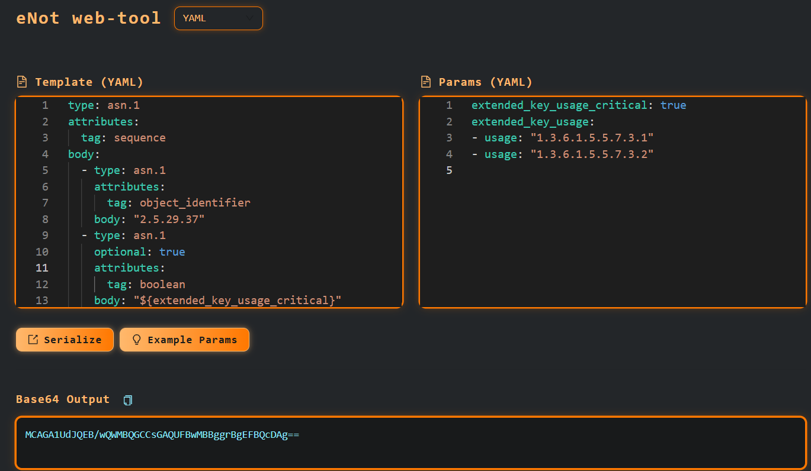

# eNot web-tool

## Description

eNot web-tool is a small web service with UI that allow quickly test serialization of eNot templates

## How to run

Build eNot project, run from eNot root directory:

```cmd
mvn clean install
```

### Option 1: Build and Run with Docker

```cmd
cd web-tool
docker build -t enot-web-tool .
docker run -d -p 8080:8080 --name enot-web-tool enot-web-tool
```

### Option 2: Run the JAR Directly

```cmd
cd web-tool/backend/target
```

Replace `{version}` with the actual version, e.g., `1.0.0-SNAPSHOT`:

```cmd
java -jar enot-web-tool-backend-{version}.jar
```

## How to Use

After starting the eNot web-tool, open your browser and go to:

```
http://localhost:8080
```



1. Make sure the correct format is selected.
2. Enter the following in the `Template` field:

    ```yaml
    type: asn.1
    attributes:
      tag: sequence
    body:
      - type: asn.1
        attributes:
          tag: object_identifier
        body: "2.5.29.37"
      - type: asn.1
        optional: true
        attributes:
          tag: boolean
        body: "${extended_key_usage_critical}"
      - type: asn.1
        attributes:
          tag: octet_string
        body:
          type: asn.1
          attributes:
            tag: sequence
          body:
            type: system
            attributes:
              kind: loop
              items_name: extended_key_usage
            body:
              type: asn.1
              attributes:
                tag: object_identifier
              body: "${usage}"
    ```

3. Enter the following in the `Params` field:

    ```
    extended_key_usage_critical: true
    extended_key_usage:
      - usage: "1.3.6.1.5.5.7.3.1"
      - usage: "1.3.6.1.5.5.7.3.2"
    ```

4. Press the `Serialize` button.

The `Base64 Output` field will display the serialized ASN.1 output encoded in base64.
